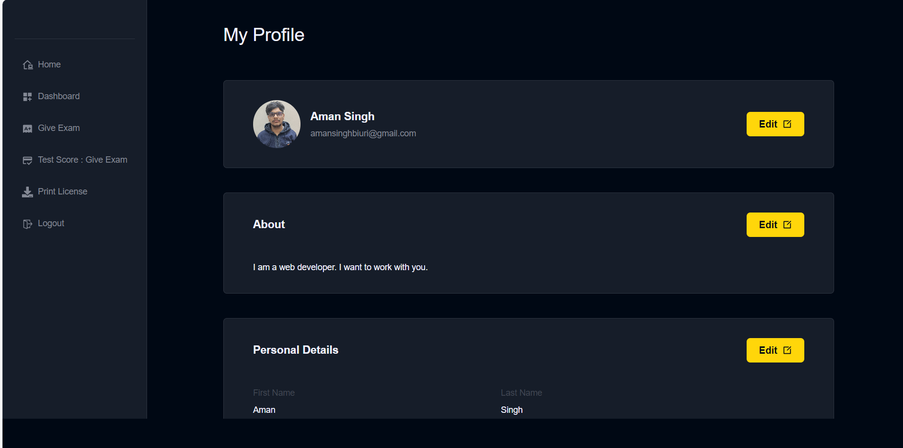

# Online Driving Licensing
:rocket: [Link to website][https://online-driving-licencing.vercel.app/]

 **For Testing : Go to the hosted Link:**
               
               You can make your Id , Please check email in spam for otp
               You can use my Id as well for testing
               Email : tinkukumar@gmail.com
               Password : 1212


# how to set up

## Setup Instructions

1. **Clone the Repository:**
   ```bash
   git clone https://github.com/Aman-s12345/Online_driving_Licencing.git 
  
**Install Dependencies:**

     ```bash
     npm install
     cd server
     npm install
     cd ..
     npm run dev

     
**Set up env file as well**

     ```bash
     in Root directory create a .env file and add REACT_APP_BASE_URL = http://localhost:4000/api/v1 
     in ./server make a .env file and you have to signup to cloudinary , make a app password of you email
     MAIL_HOST = smtp.gmail.com
     MAIL_USER = /* The mail id you used to make a app password*/
     MAIL_PASS = /* Mail password*/
     JWT_SECRET = /* Write whatever you want*/
     FOLDER_NAME =  /* folder name you created on cloudinary*/
     CLOUD_NAME = /* cloud name of cloudinary*/
     API_KEY = /*Your API_KEy of cloudinary*/
     API_SECRET = /* your Api secret of cloudinary*/
     PORT = 4000
     you can add you mongodb url in ./server/config/database.js file .


Online Driving Licensing is a fully functional  platform that enables users to create, consume, and rate educational content. The platform is built using the MERN stack, which includes ReactJS, NodeJS, MongoDB, and ExpressJS.


## Introduction

Online Driving Licensing is designed to revolutionize the process of obtaining a driving license, offering a user-friendly and interactive learning experience. Our platform aims to make driver education more accessible, engaging, and efficient.

In the following sections, we will cover the technical details of the platform, including the system architecture, API design, installation, usage instructions, and potential future enhancements.

## System Architecture

Online Driving Licencing platform consists of three main components: the front-end, the back-end, and the database. The platform follows a client-server architecture, with the front-end serving as the client and the back-end and database serving as the server.

### Front-end

The front-end of the platform is built using ReactJS, which allows for the creation of dynamic and responsive user interfaces, crucial for providing an engaging learning experience to students. The front-end communicates with the back-end using RESTful API calls.

#### Front End Pages

For User:

- **Homepage:** A brief introduction to the platform with links


- **DashBoard:** All user details.



- **Exam:** Online exam that user will give to get a license.

- **Print:** user can download the licence.


- **User Details:** Provides details about the student's account, including their name, email, and other relevant information.

- **User Edit Details:** Allows students to edit their account details.


#### Front-end Tools and Libraries

To build the front-end, we use frameworks and libraries such as ReactJS, CSS, and Tailwind for styling, and Redux for state management.

### Back-end

The back-end of the platform is built using NodeJS and ExpressJS, providing APIs for the front-end to consume. These APIs include functionalities such as user authentication, licence creation, and get user details and more. The back-end also handles the logic for processing and storing the course content and user data.


#### Back-end Features

- **User Authentication and Authorization:** User can sign up and log in to the platform using their email addresses and passwords. The platform also supports OTP (One-Time Password) verification  for added security.
- **Cloud-based Media Management:** Online Driving Licencing uses Cloudinary, a cloud-based media management service, to store and manage all media content, including images, videos, and documents.
- **Markdown Formatting:**  content in document format is stored in Markdown format, allowing for easier display and rendering on the front-end.

#### Back-end Frameworks, Libraries, and Tools

The back-end of StudyNotion uses various frameworks, libraries, and tools to ensure its functionality and performance, including:

- **Node.js:** Used as the primary framework for the back-end.
- **Express.js:** Used as a web application framework, providing a range of features and tools for building web applications.
- **MongoDB:** Used as the primary database, providing a flexible and scalable data storage solution.
- **JWT (JSON Web Tokens):** Used for authentication and authorization, providing a secure and reliable way to manage user credentials.
- **Bcrypt:** Used for password hashing, adding an extra layer of security to user data.
- **Mongoose:** Used as an Object Data Modeling (ODM) library, providing a way to interact with MongoDB using JavaScript.


### Database

The database for the platform is built using MongoDB, a NoSQL database that provides a flexible and scalable data storage solution. MongoDB allows for the storage of unstructured and semi-structured data. The database stores the course content, user data, and other relevant information related to the platform.


